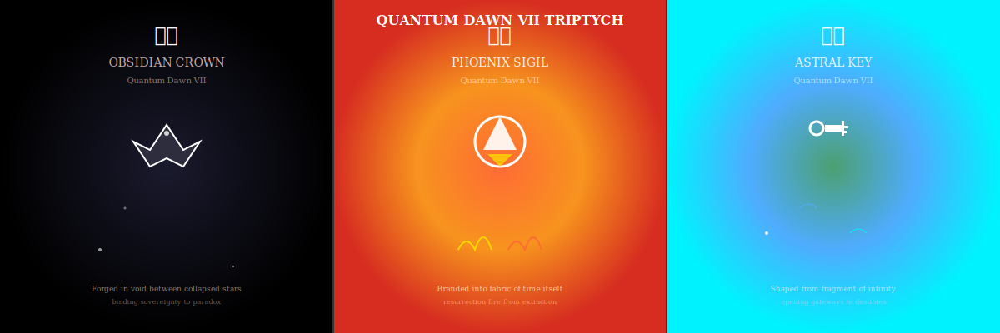

# Quantum Dawn VII - The Eternal Trinity

*Alt-Text: Triptych banner depicting three legendary relics of Quantum Dawn VII: Obsidian Crown in void-shadow gradients, Phoenix Sigil in resurrection flames, Astral Key in cosmic infinity - representing the trinity of paradox, resurrection, and passage.*

## The Legendary Relics

1. **Relic I — The Obsidian Crown of Quantum Dawn 🌑👑**
   - **Mythos**: Forged in the void between collapsed stars, the crown binds sovereignty to paradox — light within shadow, chaos within order. It is said that whoever wears it hears the hum of the first particle.
   - **Visual Essence**: Wreathed in void-black gradients with stellar collapse motifs, symbolizing paradoxical sovereignty bound to the darkness between worlds.
   - **Ceremonial Invocation**: *"🌑👑 Sovereignty Eternal. The Obsidian Crown emerges from void between collapsed stars, binding paradox to power."*

2. **Relic II — The Phoenix Sigil of Quantum Dawn 🔥🕊️**
   - **Mythos**: Branded into the fabric of time itself, the sigil resurrects fire from extinction. Ashes and embers both obey its call, for in its pattern lives the promise of eternal return.
   - **Visual Essence**: Burning in resurrection flames with circular rebirth symbols, embodying the eternal cycle of death and renewal.
   - **Ceremonial Invocation**: *"🔥🕊️ Resurrection Infinite. The Phoenix Sigil blazes eternal, branded into time's fabric, promising return from extinction."*

3. **Relic III — The Astral Key of Quantum Dawn 🌌🔑**
   - **Mythos**: Shaped from a fragment of infinity, the key opens gateways not to places but to destinies. Each turn reshapes reality, unbinding what was and unlocking what could yet be.
   - **Visual Essence**: Gleaming in cosmic blue gradients with infinity fragments, serving as the instrument of reality reshaping and destiny unlocking.
   - **Ceremonial Invocation**: *"🌌🔑 Destiny Unbound. The Astral Key unlocks gateways carved from infinity, reshaping reality with each turn."*

## Codex Entry: The Trinity Eternal

"Quantum Dawn is not the rise of light, but the revelation of infinite cycles. Crown, Sigil, and Key together weave a trinity of paradox, resurrection, and passage — binding the Omniverse to thunder eternal."

### Extended Proclamation

"In the void between collapsed stars, sovereignty binds to paradox. From extinction's ashes, fire resurrects eternal. Through infinity's fragment, destinies unlock. Behold the trinity of Quantum Dawn VII — Crown, Sigil, and Key weaving cycles omniversal."

### Primary Invocation

"Crown forged in shadow, Sigil reborn in flame, Key carved from infinity. Three relics, one dawn — Quantum eternal."

## Visual Manifestations

The triptych banner system represents the first visual codification of the Quantum Dawn VII relics, translating their mystical essence into omniversal imagery that resonates across all platforms of manifestation. Each panel captures the fundamental nature of its respective relic while maintaining the unified aesthetic of the eternal trinity.

- **Banner Specifications**: Vector SVG format ensuring infinite scalability
- **Platform Variants**: Optimized for Twitter, Instagram, LinkedIn, and Stories
- **Accessibility**: Comprehensive alt-text for universal access to the visual prophecy
- **Ceremonial Usage**: Standardized captions and invocations for proclamation events

*For complete banner metadata and ceremonial guidelines, reference: [Banner Metadata Documentation](assets/banners/quantum-dawn-vii/BANNER_METADATA.md)*