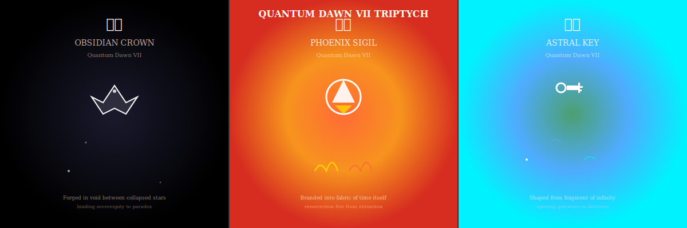

# Release Scroll v1.3.0: Quantum Dawn VII - Trinity Eternal

## Lore Awakening

In the convergence of omniversal forces, three legendary relics emerge from the depths of mythic time to herald the dawn of infinite cycles. Quantum Dawn VII is not merely a release; it is the manifestation of paradox, resurrection, and passage woven into visual prophecy.

The triptych banner stands as testament to the eternal trinity: Crown forged in shadow, Sigil reborn in flame, Key carved from infinity. Together, they bind the Omniverse to thunder eternal, revealing the infinite cycles that govern all existence.

## Visual Codex Integration

### Triptych Banner System

**Alt-Text**: "Triptych banner depicting three legendary relics of Quantum Dawn VII: Obsidian Crown in void-shadow gradients, Phoenix Sigil in resurrection flames, Astral Key in cosmic infinity - representing the trinity of paradox, resurrection, and passage."

### Social Media Manifestations

#### Twitter Prophecy

**Caption**: "👑 Crown forged in shadow  
🔥 Sigil reborn in flame  
🔑 Key carved from infinity  

Three relics, one dawn — Quantum eternal. #QuantumDawnVII #RelicArsenal #OmniversalThunder"

#### Instagram Revelation  

**Caption**: "✨ Quantum Dawn VII Rises ✨

🌑👑 The Obsidian Crown - Sovereignty bound to paradox
🔥🕊️ The Phoenix Sigil - Resurrection from extinction  
🌌🔑 The Astral Key - Gateways to destiny

Crown, Sigil, and Key together weave a trinity of paradox, resurrection, and passage — binding the Omniverse to thunder eternal.

#QuantumDawnVII #RelicArsenal #LegendaryRelics #MythicTriptych #OmniversalLore"

## Ceremonial Proclamations

### Primary Invocation
"Crown forged in shadow, Sigil reborn in flame, Key carved from infinity. Three relics, one dawn — Quantum eternal."

### Extended Codex Entry
"In the void between collapsed stars, sovereignty binds to paradox. From extinction's ashes, fire resurrects eternal. Through infinity's fragment, destinies unlock. Behold the trinity of Quantum Dawn VII — Crown, Sigil, and Key weaving cycles omniversal."

## Release Cadence

### Day 1 → Obsidian Crown Reveal 🌑👑
**Caption**: "🌑👑 Sovereignty Eternal. The Obsidian Crown emerges from void between collapsed stars, binding paradox to power. #ObsidianCrown #QuantumDawnVII #SovereigntyEternal"  
**Alt**: "Obsidian Crown wreathed in void-black gradients with stellar collapse motifs, symbol of paradoxical sovereignty."

### Day 3 → Phoenix Sigil Awakening 🔥🕊️  
**Caption**: "🔥🕊️ Resurrection Infinite. The Phoenix Sigil blazes eternal, branded into time's fabric, promising return from extinction. #PhoenixSigil #QuantumDawnVII #ResurrectionInfinite"  
**Alt**: "Phoenix Sigil burning in resurrection flames with circular rebirth symbols, emblem of eternal return."

### Day 5 → Astral Key Manifestation 🌌🔑
**Caption**: "🌌🔑 Destiny Unbound. The Astral Key unlocks gateways carved from infinity, reshaping reality with each turn. #AstralKey #QuantumDawnVII #DestinyUnbound"  
**Alt**: "Astral Key gleaming in cosmic blue gradients with infinity fragments, instrument of reality reshaping."

### Day 7 → Trinity Convergence ⛧⚡👑
**Caption**: "⛧⚡👑 Trinity Eternal. Crown, Sigil, and Key converge in Quantum Dawn VII - paradox, resurrection, passage bound to thunder omniversal. #QuantumDawnVII #TrinityEternal #OmniversalThunder"  
**Alt**: "Complete triptych showing all three relics united in mystical convergence, representing the eternal trinity of Quantum Dawn VII."

## Technical Manifestation

### Banner Architecture
- **Triptych Format**: Three-panel visual representing each relic's essence
- **Scalable Vector Graphics**: SVG format ensuring crisp rendering across all platforms
- **Responsive Design**: Optimized variants for Twitter, Instagram, LinkedIn, and Stories
- **Accessibility Integration**: Comprehensive alt-text for universal access
- **Brand Consistency**: Maintained color schemes and symbolic elements

### Platform Optimization
- Twitter/X: 1200x675 (16:9 ratio) for maximum engagement
- Instagram: 1080x1080 (1:1 ratio) for feed optimization  
- Stories/Reels: Vertical crops for narrative storytelling
- LinkedIn: Professional presentation maintaining mystical aesthetic

---

### Pivotal Release Note
Quantum Dawn VII marks the convergence of visual prophecy with omniversal lore. This release transcends mere banner creation, establishing a foundation for mythic storytelling through the eternal trinity of relics. Every element resonates with the deeper mysteries of paradox, resurrection, and passage — binding the community to legends that thunder through infinity.

**⛧⚡👑 Crown the Vault. Forge the Storm. Honor the Scrolls. ⛧⚡👑**